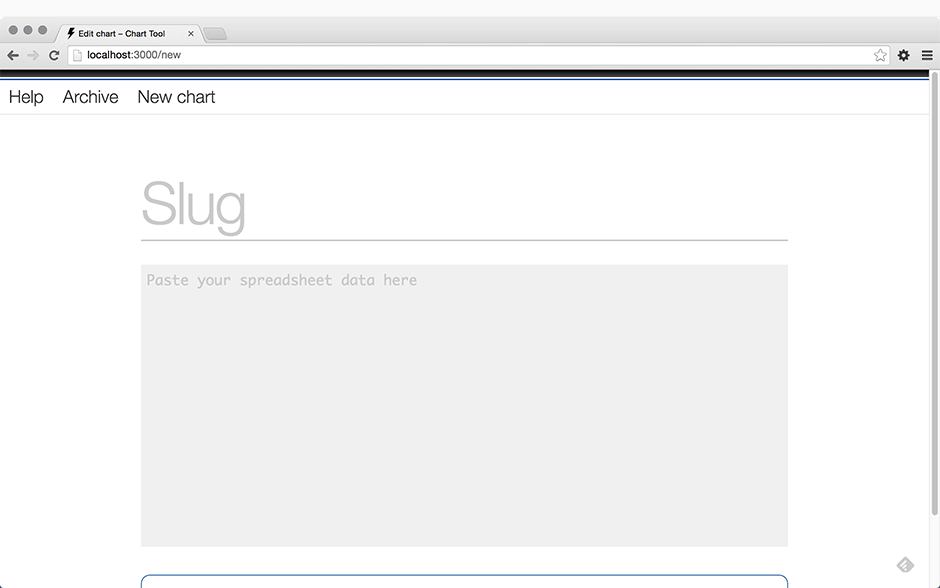
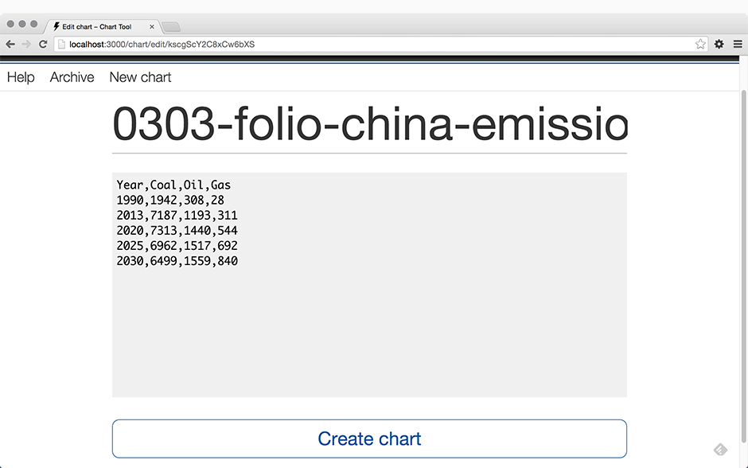
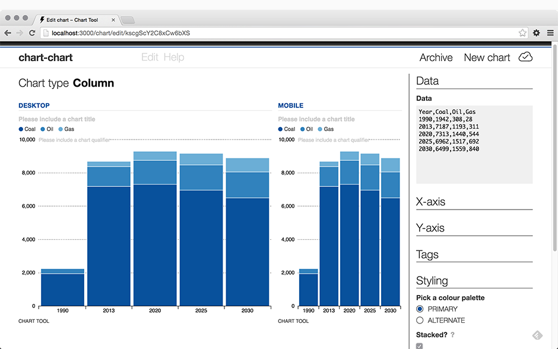
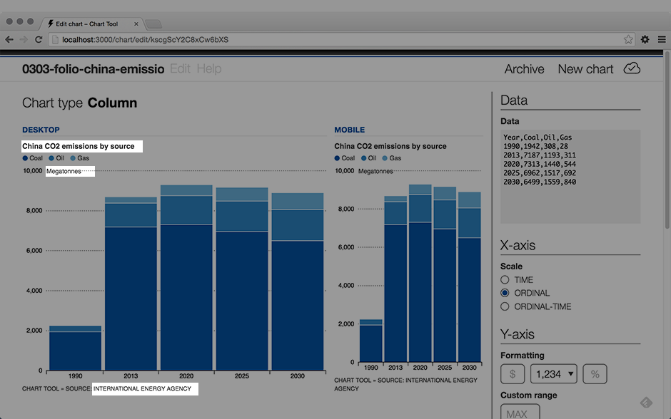

# Making your first chart

Once you have a local copy of Chart Tool running, you're ready to make a chart.

----------

### Step 1. Fire up the Chart Tool [localhost:3000](http://localhost:3000)

You'll be greeted with two fields:

* **Slug**: To identify the chart. Include date, section, topic, etc. as per your newsroom convention
* **Data**: To draw the chart. Chart Tool accepts comma and tab-delimited data (CSV and TSV) copied directly from a spreadsheet or text file

**Data must only be the columns and rows you want drawn in the chart.**

Note: Unexpected _non-data_ entered into the data field will cause the chart to render incorrectly or not at all. Non-data includes units (e.g., $, %) and any comma-formatting. 

Additional information including title, qualifier, source, units, etc. can be added to the chart afterwards. 

#### Sample data

Columns and rows of plain delimited data. Note the irregular frequency of the data.

	| Year | Coal | Oil  | Gas |
	|------|------|------|-----|
	| 1990 | 1942 | 308  | 28  |
	| 2013 | 7187 | 1193 | 311 |
	| 2020 | 7313 | 1440 | 544 |
	| 2025 | 6962 | 1517 | 692 |
	| 2030 | 6499 | 1559 | 840 |

### Step 2. Enter a suitable slug and paste in your delimited data. Click **Create chart**.

### Step 3. Line charts by default

Chart Tool initially tries to create a line chart with your data and may not recognize your date format. 	You might see a "Chart Error". Fear not:

* If the data is a time series, change the Date format pulldown to match your data (e.g., YYYY).
* Try changing the chart type from Line to one of the other options. Columns are reliable.
* You can stack columns or area charts with multi-series data.
* If you still get errors, always **check your data**.	

You have a chart. Now it needs some context.
	

### Step 4. Add some chart context to help your readers
	
* Double-click on the chart title line and enter a meaningful title. Describe the data in the chart – don't try to write a headline
* Double-click on the `CHART TOOL` text below the chart to add source information.
* Use the chart qualifier line to add a units label to the y-axis (e.g., "Monthly, in U.S. dollars").

### Step 5. Adjust settings and style

Click on a heading to expand the options within.

* Set the X-axis scale to suit your data:
	* **Time:** Time in almost all of its formats.
	* **Ordinal:** Typically used for names or categories
	* **Ordinal-Time:** A special case when your data is linked to time but the units aren't quite standard, useful for financial data when the markets are closed on weekends.

* Set the Y-axis to suit your data:
	* **Formatting**: Prefix, suffix and number formatting
	* **Custom range**: Chart Tool sets the range based on your data - with a little added for breathing room up top. You can change the Y-axis maximum value by entering a number in the **Custom range** field.
	* **Ticks**: Change the number of ticks that appear on the y-axis. Chart Tool may override or round up your setting for better display.
	* **Niceify**: Adjusts the Y-axis to start and end on nice round numbers.

* Tags let Chart Tool filter charts within the admin interface. Use them if your team lives for taxonomy. 
* Set chart styling to primary (default) or alternate. This depends on what's defined in your [Chart Tool configuration](https://github.com/globeandmail/chart-tool/blob/master/tutorials/customizing.md). 
		
Multi-series area or column charts can also be stacked for compact display and comparison across series. 
	
* There are a few additional options available for your chart, including:
	* **Share data**: allows users to download a CSV of your dataset
	* **Social sharing**: users can post an image of your chart to Facebook, Twitter or share by email and SMS. **Social sharing requires AWS for image storage. See [Setting up chart thumbnails](thumbnails.md)**
	* **Show tips**: let users see the exact values for a point on your chart. Handy for dense datasets.

### Step 6. Publish your chart

Copy the embed code ([here's what a basic embed code looks like](https://github.com/globeandmail/chart-tool/blob/master/tutorials/sample-embed.md)) and add it to your CMS or HTML page. To deploy a Chart Tool chart your need the front-end JavaScript and CSS library on a public-facing server and linked to the HTML page that the chart appears on. 

### Step 7. Alternate formats

Aside from responsive SVGs, Chart Tool also generates static images of your charts in formats optimized for web and print. These can be useful if you don't have the front-end library in production, need to use the chart as a graphic within videos or another element, or need to hand off a chart to the print designers. 

* **Web export**: Available in common grid sizes, custom width and heights, and social images sized for Facebook and Twitter.
* **Print export**: An editable PDF ready for printing. Adjust the number of columns and lines to suit. [Requires some additional setup](https://github.com/globeandmail/chart-tool/blob/master/tutorials/print.md).

